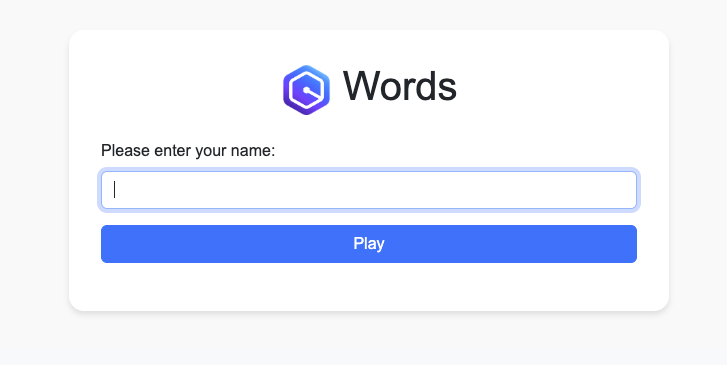
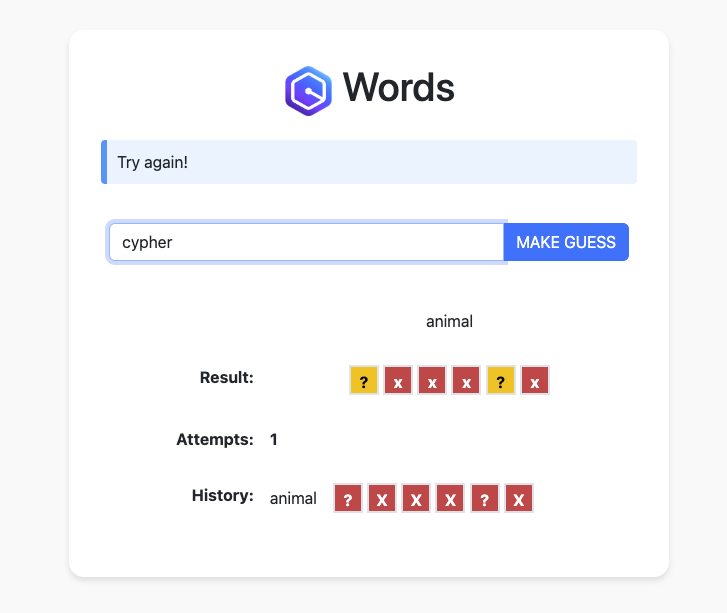
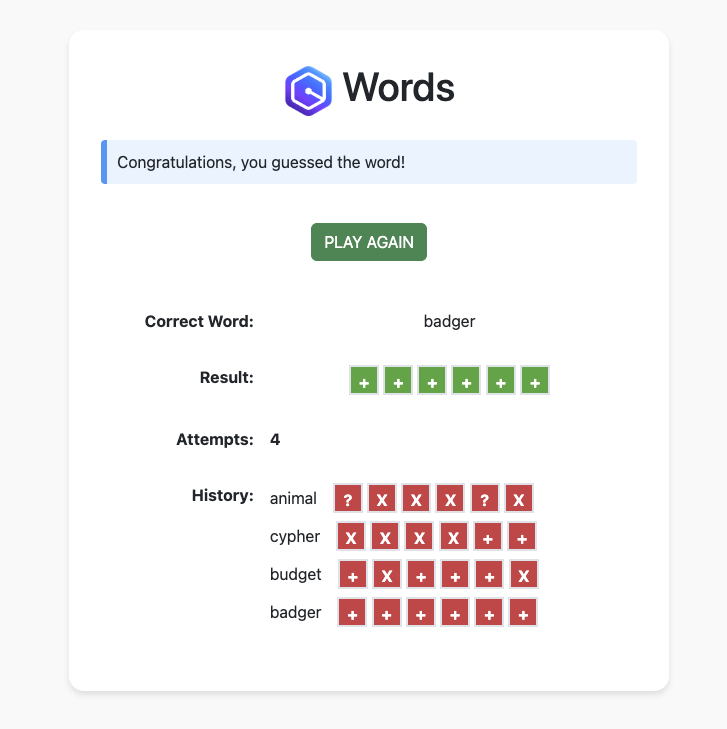
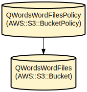

# Q-Words - 실시간 피드백을 제공하는 현대적인 단어 추측 게임 🎯

 |   | 
---|---|---|

해당 프로젝트는 Amazon Q Developer AI Agent를 이용한 AWS TechCamp Online 프로젝트입니다.  
[참고 사이트](https://catalog.workshops.aws/qwords/ko-KR)

Q-Words는 Spring Boot 기반의 단어 추측 게임으로, 플레이어들에게 어휘 실력을 테스트할 수 있는 매력적이고 상호작용적인 경험을 제공합니다. 이 게임은 직관적인 인터페이스를 통해 추측에 대한 즉각적인 피드백을 제공하며, 세션 관리를 통해 여러 플레이어를 지원합니다.

모든 단어 감정가가 이해하듯이, 이 애플리케이션은 현대적인 웹 기술과 견고한 백엔드 처리를 결합하여 반응성 있는 게임 경험을 제공합니다. 플레이어는 6글자 단어를 추측하기 위해 5번의 시도 기회가 있으며, 각 추측에 대해 올바른 글자, 잘못 배치된 글자, 틀린 글자를 나타내는 색상 코드 피드백을 받습니다. 게임은 애니메이션과 시각적 피드백으로 플레이어 경험을 향상시키는 깔끔한 사용자 인터페이스를 특징으로 합니다.  

## 저장소 구조
```
.
├── src/                           # 소스 코드 루트 디렉토리
│   ├── main/
│   │   ├── java/                 # Java 소스 파일
│   │   │   └── com/sample/qwords/
│   │   │       ├── controller/   # 게임 로직과 오류 처리를 위한 MVC 컨트롤러
│   │   │       ├── model/        # 게임 상태와 단어를 위한 도메인 모델
│   │   │       ├── repository/   # 단어 저장 및 검색
│   │   │       └── service/      # 단어 선택을 위한 비즈니스 로직
│   │   └── resources/
│   │       ├── static/           # 프론트엔드 자산 (JS, 이미지)
│   │       ├── templates/        # Thymeleaf HTML 템플릿
│   │       └── words.txt         # 단어 사전 파일
├── proxy/                        # 개발용 Node.js 프록시 서버
│   ├── logger.js                 # 프록시용 로깅 유틸리티
│   └── server.js                # Express 프록시 서버 구현
└── pom.xml                      # Maven 프로젝트 설정
```

## 사용 방법
### 필수 요구사항
- Java Development Kit (JDK) 8 이상
- Maven 3.6 이상
- Node.js 14+ (개발 프록시용)
- JavaScript가 활성화된 최신 웹 브라우저

### 설치

1. 저장소 복제:
```bash
git clone <repository-url>
cd qwords
```

2. Java 애플리케이션 빌드:
```bash
mvn clean install
```

3. 개발 프록시 설정 (선택사항):
```bash
cd proxy
npm install
```

### 빠른 시작
1. Spring Boot 애플리케이션 시작:
```bash
mvn spring-boot:run
```

2. 개발 프록시 시작 (선택사항):
```bash
cd proxy
node server.js
```

3. 애플리케이션 접속:
- 직접 접속: http://localhost:8090
- 프록시를 통한 접속: http://localhost:3000/proxy/8090

### 상세한 사용 예시

게임 플레이:
```javascript
// 게임 상호작용 예시
1. 홈페이지에서 이름 입력
2. 6글자 단어 추측 제출
3. 피드백 받기:
   '+' = 올바른 글자, 올바른 위치
   '?' = 올바른 글자, 잘못된 위치
   'X' = 단어에 없는 글자
```

### 문제 해결

일반적인 문제들:
1. 애플리케이션이 시작되지 않는 경우
   - 포트 8090이 사용 가능한지 확인
   - `java -version`으로 Java 버전 확인
   - `proxy/logs/error.log`에서 로그 확인

2. 프록시 연결 문제
   - 프록시 서버가 포트 3000에서 실행 중인지 확인
   - 프록시 로그 확인: `proxy/logs/proxy.log`
   - `server.js`에서 대상 URL 설정 확인

3. 게임 상태 문제
   - 브라우저 캐시와 쿠키 삭제
   - 브라우저 콘솔에서 JavaScript 오류 확인
   - Spring Boot 로그에서 세션 속성 확인

## 데이터 흐름
애플리케이션은 세션 기반 게임 상태 관리를 통한 표준 MVC 아키텍처를 따릅니다.

```ascii
[브라우저] -> [프록시 서버] -> [Spring Boot 앱]
     |           |                    |
     |           |        [단어 선택 서비스]
     |           |                    |
     |           |         [단어 저장소]
     |           |                    |
[UI 업데이트] <- [응답] <-   [게임 로직]
```

주요 컴포넌트 상호작용:
- 프론트엔드는 프록시를 통해 백엔드로 추측 요청을 전송
- GameController가 추측을 처리하고 게임 상태를 유지
- WordSelectionService가 저장소에서 랜덤 단어를 제공
- 프록시 서버가 로깅과 요청/응답 모니터링을 처리
- 서버 응답과 게임 상태에 따라 UI 업데이트

## 인프라스트럭처


AWS 리소스:
- S3 버킷: `qwords-word-files`
  - 타입: AWS::S3::Bucket
  - 목적: 단어 사전 파일 저장
  - 공개 읽기 접근 활성화

- S3 버킷 정책: `QWordsWordFilesPolicy`
  - 타입: AWS::S3::BucketPolicy
  - 목적: 단어 파일에 대한 공개 접근 관리
  - GetObject 작업 허용

---

당신의 모음이 풍부하고 자음이 잘 배치되기를! 🎮✨